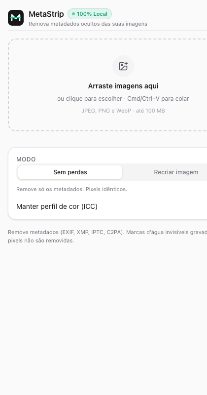

# MetaStrip 🇧🇷

<p align="center">
  <strong>Inspecione e remova metadados ocultos de imagens — 100% no seu navegador.</strong><br>
  EXIF · Coordenadas GPS · XMP · IPTC · Certificados C2PA de IA · Assinaturas de Geradores
</p>

<p align="center">
  <a href="README.en.md">🇺🇸 <strong>Read this documentation in English</strong></a>
</p>

<p align="center">
  
  
  
  
  
</p>

---

<p align="center">
  
</p>

---

## Por que o MetaStrip foi criado?

Ao gerar imagens no **ChatGPT, Midjourney, Adobe Firefly, Canva** ou tirar fotos no celular, o arquivo carrega dados ocultos além dos pixels visíveis:
- **Manifestos C2PA e tags IPTC (`trainedAlgorithmicMedia`):** Assinaturas criptográficas embutidas por ferramentas de IA que ativam rótulos automáticos em redes sociais como Facebook e Instagram (*"Info de IA"* / *"Feito com IA"*).
- **Dados Privados:** Número de série da câmera, localização exata por GPS, data/hora de captura e histórico de edições.
- **Prompts de Geração:** No Stable Diffusion, ComfyUI ou Automatic1111, o prompt completo e os parâmetros ficam gravados nos blocos de texto do PNG (`parameters`).

O **MetaStrip** inspeciona a estrutura dos arquivos, lista cada bloco encontrado e remove tudo de forma cirúrgica, sem enviar nenhum byte para servidores externos.

---

## Principais Funcionalidades

- 📌 **Painel Lateral Nativo do Chrome:** Fica acoplado na lateral do navegador (igual ao Mimik). Você pode navegar no ChatGPT ou Midjourney e arrastar as imagens direto da página para dentro do MetaStrip!
- 🔍 **Inspetor Profundo:** Detecta manifestos C2PA (bloco `caBX` em PNG / APP11 em JPEG), tags IPTC `DigitalSourceType`, EXIF, GPS e XMP.
- 🧼 **Limpeza Sem Perdas (Lossless):** Remove apenas os metadados mantendo a compressão original dos pixels idêntica (100% da qualidade original preservada).
- 🎨 **Modo Recriar Imagem:** Gera uma nova imagem limpa do zero com presets otimizados para redes sociais (`1080×1080` Feed 1:1, `1080×1350` Feed 4:5, `1080×1920` Stories).
- 📦 **Download em Lote (.ZIP):** Arraste várias imagens de uma vez e baixe todas limpas em um único arquivo `.zip` com 1 clique.
- 🖱️ **Menu de Contexto:** Clique com o botão direito em qualquer imagem da web ➔ *"Baixar sem metadados (MetaStrip)"*.
- 🌐 **100% Bilíngue (PT-BR / EN):** Alterne entre Português e Inglês com 1 clique direto no topo da extensão.
- 🔒 **Privacidade Total:** Processamento 100% no cliente via TypeScript e Web APIs. Zero servidores, zero rastreamento.

---

## O que o MetaStrip *Não* Faz

O MetaStrip remove **metadados e manifestos de cabeçalho**. Ele **não** altera marcas d'água esteganográficas invisíveis nos próprios pixels (como o Google DeepMind SynthID). Respeite sempre as políticas das plataformas sobre identificação de mídias fotorrealistas geradas por inteligência artificial.

---

## Estrutura do Projeto

```
MetaStrip/
├── packages/
│   ├── core/         # Motor em TypeScript puro para JPEG, PNG e WebP (zero dependências, sem DOM).
│   └── ui/           # Interface compartilhada em React 19 + Tailwind CSS, bilíngue e gerador de ZIP.
├── apps/
│   ├── extension/    # Extensão Manifest V3 (WXT) com Painel Lateral e menu de contexto.
│   └── web/          # Aplicação web pública (Next.js com exportação estática).
└── docs/             # Imagens, arquitetura e documentação.
```

---

## Como Usar

### Opção 1: Instalação Rápida no Chrome / Brave / Edge

1. Baixe o arquivo `metastripextension-0.1.0-chrome.zip` na página de [Releases](https://github.com/vjuniords/metastrip/releases).
2. Descompacte o arquivo `.zip` no seu computador.
3. Abra `chrome://extensions` no navegador.
4. Ative o **Modo do desenvolvedor** (canto superior direito).
5. Clique em **Carregar sem compactação** e selecione a pasta descompactada `chrome-mv3`.
6. Clique no ícone do MetaStrip na barra de extensões para abrir o Painel Lateral!

### Opção 2: Desenvolvimento Local

```bash
# Clone o repositório
git clone https://github.com/vjuniords/metastrip.git
cd metastrip

# Instale as dependências
pnpm install

# Execute os testes unitários e de robustez
pnpm test

# Inicie a extensão em modo desenvolvimento (abre o Chrome com recarregamento automático)
pnpm dev:ext

# Gere o pacote de produção
pnpm --filter @metastrip/extension build
```

---

## Segurança e Privacidade

Consulte nossa [Política de Segurança](SECURITY.md). O motor possui validação estrita de limites de bytes e testes com arquivos corrompidos para garantir estabilidade. O tamanho máximo por arquivo é de 100 MB.

---

## Licença

Distribuído sob a licença [MIT](LICENSE) © 2026 Contribuidores do MetaStrip.
